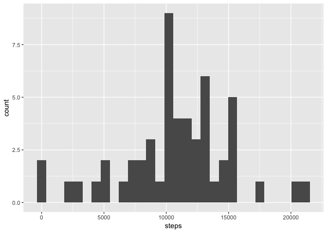
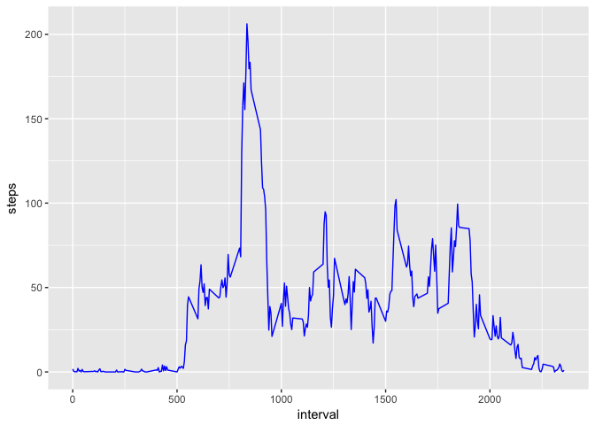
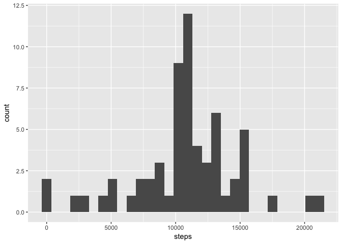
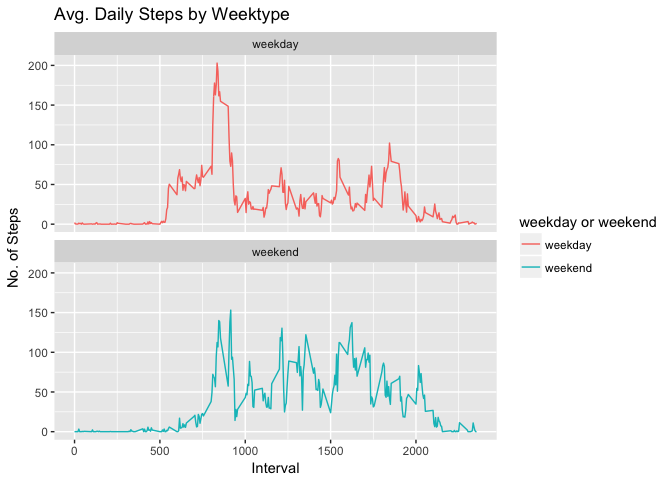

#Introduction

It is now possible to collect a large amount of data about personal movement using activity monitoring devices such as a Fitbit, Nike Fuelband, or Jawbone Up. These type of devices are part of the “quantified self” movement – a group of enthusiasts who take measurements about themselves regularly to improve their health, to find patterns in their behavior, or because they are tech geeks. But these data remain under-utilized both because the raw data are hard to obtain and there is a lack of statistical methods and software for processing and interpreting the data.

This assignment makes use of data from a personal activity monitoring device. This device collects data at 5 minute intervals through out the day. The data consists of two months of data from an anonymous individual collected during the months of October and November, 2012 and include the number of steps taken in 5 minute intervals each day.

The data for this assignment can be downloaded from the course web site:

Dataset: [Activity monitoring data](https://d396qusza40orc.cloudfront.net/repdata%2Fdata%2Factivity.zip)

The variables included in this dataset are:

* steps: Number of steps taking in a 5-minute interval (missing values are coded as 𝙽𝙰)
* date: The date on which the measurement was taken in YYYY-MM-DD format
* interval: Identifier for the 5-minute interval in which measurement was taken

The dataset is stored in a comma-separated-value (CSV) file and there are a total of 17,568 observations in this dataset.

## Loading and preprocessing the data

Downloading the zip file using the provided URL


```r
#fileUrl <- "https://d396qusza40orc.cloudfront.net/repdata%2Fdata%2Factivity.zip"
#download.file(fileUrl, destfile = paste0(getwd(), '/repdata%2Fdata%2Factivity.zip'), method = "curl")
#unzip("repdata%2Fdata%2Factivity.zip",exdir = "data")
```

### Adding required libraries


```r
library(ggplot2)
library(dplyr)
```

```
## 
## Attaching package: 'dplyr'
```

```
## The following objects are masked from 'package:stats':
## 
##     filter, lag
```

```
## The following objects are masked from 'package:base':
## 
##     intersect, setdiff, setequal, union
```

1. Load the data (i.e. 𝚛𝚎𝚊𝚍.𝚌𝚜𝚟())

Unzipping the downloaded zip files gives a .csv file


```r
activity <- read.csv("data/activity.csv")
```

To see what data looks like.


```r
head(activity)
```

```
##   steps       date interval
## 1    NA 2012-10-01        0
## 2    NA 2012-10-01        5
## 3    NA 2012-10-01       10
## 4    NA 2012-10-01       15
## 5    NA 2012-10-01       20
## 6    NA 2012-10-01       25
```

To know more about the data in various columns and range of values associated with them.


```r
summary(activity)
```

```
##      steps                date          interval     
##  Min.   :  0.00   2012-10-01:  288   Min.   :   0.0  
##  1st Qu.:  0.00   2012-10-02:  288   1st Qu.: 588.8  
##  Median :  0.00   2012-10-03:  288   Median :1177.5  
##  Mean   : 37.38   2012-10-04:  288   Mean   :1177.5  
##  3rd Qu.: 12.00   2012-10-05:  288   3rd Qu.:1766.2  
##  Max.   :806.00   2012-10-06:  288   Max.   :2355.0  
##  NA's   :2304     (Other)   :15840
```

2. Process/transform the data (if necessary) into a format suitable for your analysis

There are some NA values which are needed to be omitted so that they do not interfere in our analysis


```r
activityComplete <- na.omit(activity)
```

## What is mean total number of steps taken per day?

This problem can be answered by few steps which are mentioned below.

1. Calculate the total number of steps taken per day


```r
activityDay <- group_by(activityComplete, date)
activityDay <- summarise(activityDay, steps = sum(steps))
```

2. If you do not understand the difference between a histogram and a barplot, research the difference between them. Make a histogram of the total number of steps taken each day


```r
qplot(steps, data = activityDay)
```

```
## `stat_bin()` using `bins = 30`. Pick better value with `binwidth`.
```

<!-- -->

3. Calculate and report the mean and median of the total number of steps taken per day


```r
mean(activityDay$steps)
```

```
## [1] 10766.19
```

```r
median(activityDay$steps)
```

```
## [1] 10765
```

## What is the average daily activity pattern?

1. Make a time series plot (i.e. 𝚝𝚢𝚙𝚎 = "𝚕") of the 5-minute interval (x-axis) and the average number of steps taken, averaged across all days (y-axis)


```r
activityInterval <- group_by(activityComplete, interval)
activityInterval <- summarise(activityInterval, steps = mean(steps))
```

Plotting the graph with interval as x-axis and average daily steps as y-axis


```r
ggplot(activityInterval, aes(interval, steps)) + geom_line(color = 'blue')
```

<!-- -->

2. Which 5-minute interval, on average across all the days in the dataset, contains the maximum number of steps?

Now we will look for the row in the activityInterval for which steps is equal to the maximum number of steps.


```r
maximum <- max(activityInterval$steps)
activityInterval[activityInterval$steps == maximum,]
```

```
## # A tibble: 1 x 2
##   interval steps
##      <int> <dbl>
## 1      835   206
```

## Imputing missing values

There are some observations for which values of steps coded as NA. Existence of these missing values can interfere in our analysis.

1. Calculate and report the total number of missing values in the dataset (i.e. the total number of rows with 𝙽𝙰s)

Total number of rows which have NAs can be calculated by taking the difference between the number of rows of activity and activityComplete


```r
nrow(activity) - nrow(activityComplete)
```

```
## [1] 2304
```

2. Devise a strategy for filling in all of the missing values in the dataset. The strategy does not need to be sophisticated. For example, you could use the mean/median for that day, or the mean for that 5-minute interval, etc.

We can replace missing values with the mean number of steps for each interval across all of the days. activityInterval has these means, therfore, we will merge activityInterval with raw data that is, activity.


```r
names(activityInterval)[2] <- "meanSteps"
activityImpute <- merge(activity, activityInterval)
```

3. Create a new dataset that is equal to the original dataset but with the missing data filled in.

NA is now replaced with the mean number of steps for that interval.


```r
activityImpute$steps[is.na(activityImpute$steps)] <- activityImpute$meanSteps[is.na(activityImpute$steps)]
```

4. Make a histogram of the total number of steps taken each day and Calculate and report the mean and median total number of steps taken per day. Do these values differ from the estimates from the first part of the assignment? What is the impact of imputing missing data on the estimates of the total daily number of steps?

Creating a dataset with total steps per dat using the imputed data.


```r
activityImpute_1 <- group_by(activityImpute, date)
activityImpute_1 <- summarise(activityImpute_1, steps = sum(steps))
```

Generating the histogram


```r
qplot(steps, data = activityImpute_1)
```

```
## `stat_bin()` using `bins = 30`. Pick better value with `binwidth`.
```

<!-- -->

Summary of statistics


```r
mean(activityImpute_1$steps)
```

```
## [1] 10766.19
```

```r
median(activityImpute_1$steps)
```

```
## [1] 10766.19
```

Mean remains unaffected by simple data imputation but the median got smaller.

## Are there differences in activity patterns between weekdays and weekends?

For this part the 𝚠𝚎𝚎𝚔𝚍𝚊𝚢𝚜() function may be of some help here. Use the dataset with the filled-in missing values for this part.

1. Create a new factor variable in the dataset with two levels – “weekday” and “weekend” indicating whether a given date is a weekday or weekend day.

Firstly, we will read data as a table and then convert date into POSIXct and then add Day of Week to record day associated to a date.


```r
activity <- data.table::fread(input = "data/activity.csv")
activity[, date := as.POSIXct(date, format = "%Y-%m-%d")]
activity[, `Day of Week`:= weekdays(x = date)]
activity[grepl(pattern = "Monday|Tuesday|Wednesday|Thursday|Friday", x = `Day of Week`), "weekday or weekend"] <- "weekday"
activity[grepl(pattern = "Saturday|Sunday", x = `Day of Week`), "weekday or weekend"] <- "weekend"
activity[, `weekday or weekend` := as.factor(`weekday or weekend`)]
head(activity, 10)
```

```
##     steps       date interval Day of Week weekday or weekend
##  1:    NA 2012-10-01        0      Monday            weekday
##  2:    NA 2012-10-01        5      Monday            weekday
##  3:    NA 2012-10-01       10      Monday            weekday
##  4:    NA 2012-10-01       15      Monday            weekday
##  5:    NA 2012-10-01       20      Monday            weekday
##  6:    NA 2012-10-01       25      Monday            weekday
##  7:    NA 2012-10-01       30      Monday            weekday
##  8:    NA 2012-10-01       35      Monday            weekday
##  9:    NA 2012-10-01       40      Monday            weekday
## 10:    NA 2012-10-01       45      Monday            weekday
```

2. Make a panel plot containing a time series plot (i.e. type = “l”) of the 5-minute interval (x-axis) and the average number of steps taken, averaged across all weekday days or weekend days (y-axis). See the README file in the GitHub repository to see an example of what this plot should look like using simulated data.

Secondly, plotting the graph.


```r
activity[is.na(steps), "steps"] <- activity[, c(lapply(.SD, median, na.rm = TRUE)), .SDcols = c("steps")]
Interval <- activity[, c(lapply(.SD, mean, na.rm = TRUE)), .SDcols = c("steps"), by = .(interval, `weekday or weekend`)] 
ggplot(Interval , aes(x = interval , y = steps, color=`weekday or weekend`)) + geom_line() + labs(title = "Avg. Daily Steps by Weektype", x = "Interval", y = "No. of Steps") + facet_wrap(~`weekday or weekend` , ncol = 1, nrow=2)
```

<!-- -->
